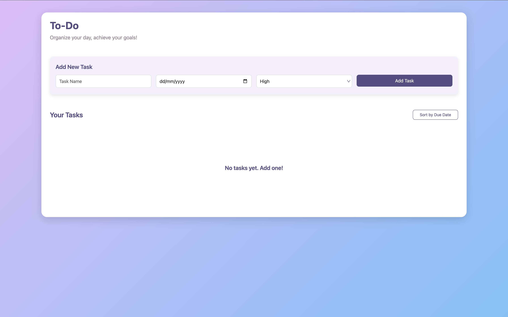
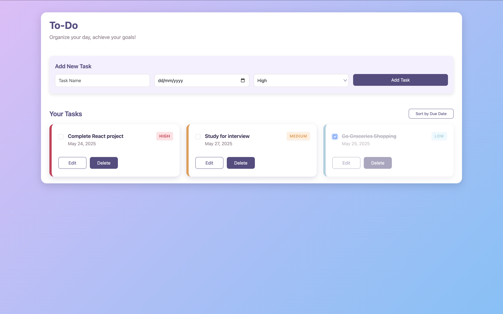
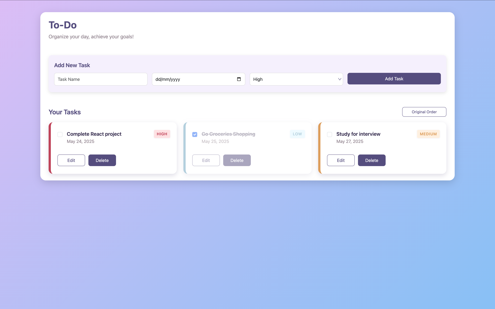
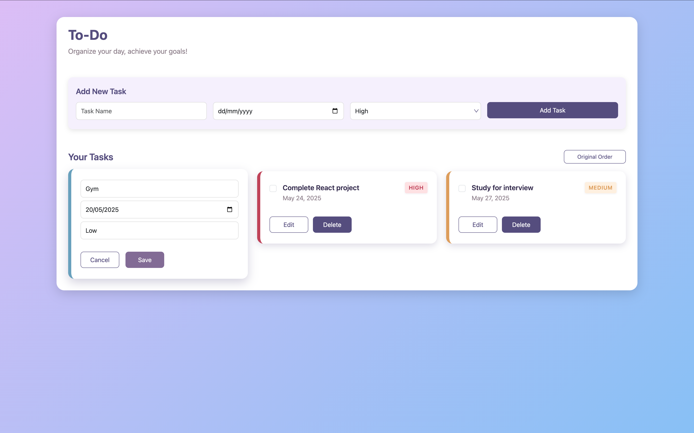
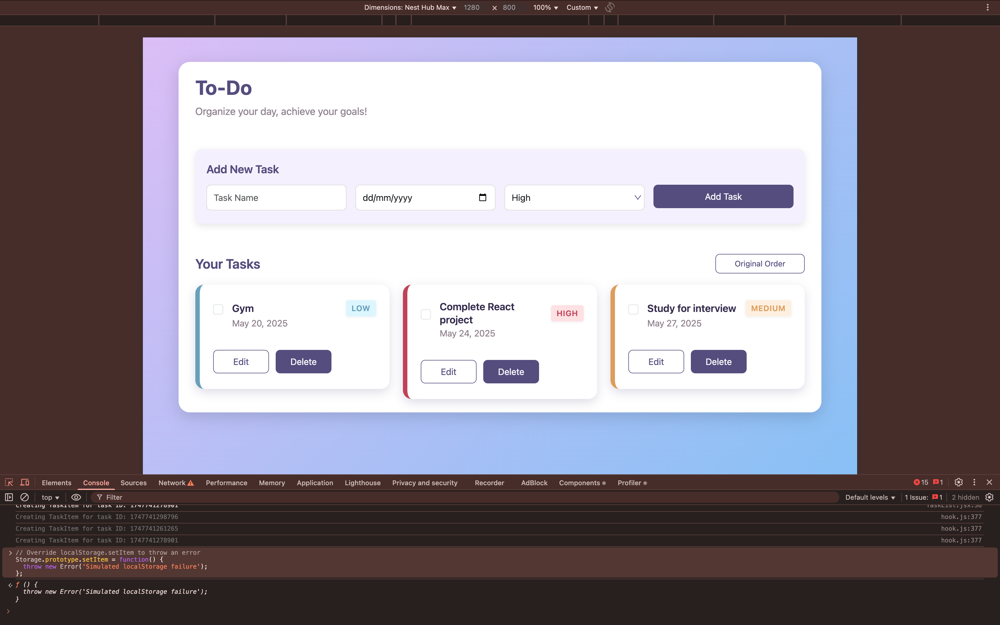

# 📝 Todo App

A simple, responsive, and feature-rich Todo application built with **React + Vite**. This app lets you manage tasks with ease — add, edit, delete, mark as complete, sort by due date, and persist your data using the browser's `localStorage`.

## 🌐 Live Demo

👉 [Check it out here](https://tasknavigatorpro.netlify.app/)

## 🚀 Features

- **Add Tasks** — with title, description, and due date
- **Edit Tasks** — modify any field as needed
- **Delete Tasks** — remove completed or unwanted tasks
- **Mark as Completed** — strike-through effect for finished tasks
- **Sort by Due Date** — ascending or descending order
- **Persistent Storage** — tasks saved to `localStorage`
- **Error Handling** — warns if `localStorage` is unavailable or fails
- **Responsive UI** — built with Bootstrap for mobile-friendly experience

## 🛠 Tech Stack

- **React**
- **Vite**
- **React Hooks** (`useState`, `useEffect`)
- **Bootstrap**
- **LocalStorage API**

## 📋 Run Locally

Clone the project

```bash
  git clone https://github.com/dhokabhoomi/ToDoApp.git
```

Go to the project directory

```bash
  cd ToDoApp
```

Install dependencies

```bash
  npm install
```

Start the server

```bash
  npm run start
```

## 📂 Project Structure

```
src/
├── assets.jsx
│   └── To-do.svg             # Application logo image asset
├── components/
│   ├── App.jsx               # Root component, main app container
│   ├── Todo.jsx              # Main Todo feature container component
│   ├── TaskList.jsx          # Component responsible for displaying the list of tasks
│   ├── TaskItems.jsx         # Individual task item component, handles task display and actions
│   ├── TodoInput.jsx         # Form component for adding/editing tasks
│   ├── Errors.jsx            # Component to display error messages (e.g., storage errors)
│   └── Todo.css              # Stylesheet for Todo-related components, including custom and Bootstrap overrides
└── main.jsx                  # Application entry point, renders <App /> to the DOM

```

## ⚠️ LocalStorage Error Handling

If the app cannot access or write to `localStorage` (e.g., due to browser restrictions or incognito mode), a warning alert is shown:

```jsx
{
  storageError && (
    <div className="alert alert-warning mt-3" role="alert">
      {storageError}
    </div>
  );
}
```

## 🖼️ App Screenshots

| Empty State                     | Tasks Added                     |
| ------------------------------- | ------------------------------- |
|  |  |

| Completed Task                         | Sorted Tasks                      |
| -------------------------------------- | --------------------------------- |
|  |  |

| Edit Task                     | LocalStorage Error              |
| ----------------------------- | ------------------------------- |
|  |  |

## 👩‍💻 Author

Developed by **Bhoomi Dhoka**
🔗 [GitHub - @dhokabhoomi](https://github.com/dhokabhoomi)
